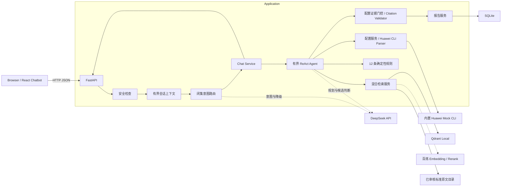
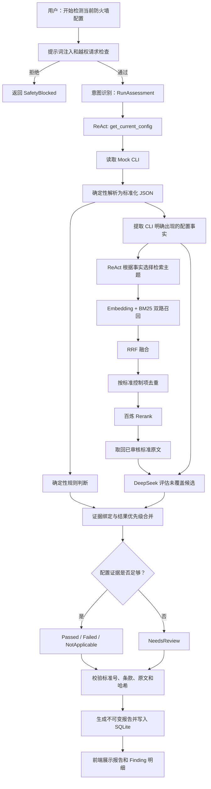

# Bank Firewall Compliance Chatbot

[](https://github.com/TZ3070/firewall-compliance/actions/workflows/ci.yml)

银行防火墙配置合规检测演示系统。用户通过 React 单页 Chatbot 查询配置、触发检测、筛选 Finding、查看判断依据和历史报告。后端使用 FastAPI 运行有步数上限、工具白名单和证据门控的 ReAct Agent。

系统当前只检测项目内置的 Huawei Mock CLI，不连接真实设备，不自动修改防火墙配置。输出是可复核的配置检测结果，不等同于正式等级保护测评结论。

## 功能

- 自然语言查询内置防火墙的原始 CLI 或结构化 JSON。
- 通过受控 ReAct Agent 触发完整配置检测。
- Agent 根据 CLI 中明确出现的配置事实动态选择标准检索主题。
- 12 条本地确定性规则优先输出高置信度结果；未覆盖条款由 DeepSeek 辅助判断。
- 四态 Finding：`Passed`、`Failed`、`NeedsReview`、`NotApplicable`。
- 按结果、严重程度、标准编号和 Finding ID 筛选历史报告。
- 展示 Finding 的配置证据、标准原文、判断说明和限制。
- 基于上一轮消息、上一轮意图和上次查询对象的有界上下文处理。
- 混合 RAG：百炼 Embedding/本地 BGE + BM25 + RRF + 按控制项去重 + 百炼 Rerank。
- 标准引用门禁：只允许已人工审核、可引用且哈希匹配的原文进入报告。
- Snapshot 和 Report 保存到 SQLite，报告绑定 SHA-256 并拒绝更新和删除。
- DeepSeek、Embedding 或 Rerank 不可用时返回降级提示，并在安全范围内继续执行。

## 技术栈

| 层级 | 技术 |
|---|---|
| 前端 | React 19、TypeScript、Vite |
| API | FastAPI、Pydantic v2、Uvicorn |
| Agent | 自定义有界 ReAct 状态机，最多 6 步 |
| 大模型 | DeepSeek，用于意图识别、检索规划、候选条款判断和结果解释 |
| 检索 | Qdrant Local、百炼 Embedding、BM25、RRF、百炼 Rerank |
| 规则 | Python 确定性规则引擎 |
| 存储 | SQLite 不可变 Snapshot/Report、本地 Qdrant 索引 |
| 质量 | Pytest、Vitest、TypeScript、GitHub Actions |

## 系统架构



### 配置检测主链路



Agent 只能从以下工具中选择：`get_current_config`、`retrieve_standards`、`evaluate_compliance_candidates`、`create_report`、`finish`。工具循环最多 6 步，检索最多执行两次，模型不能创建工具、执行 SQL/Shell 或修改配置。

## 模块划分

| 路径 | 职责 | 测试入口 |
|---|---|---|
| `frontend/src` | Chatbot UI、报告/Finding 展示、历史报告详情 | `frontend/src/*.test.ts` |
| `backend/app/api` | Health、Chat、Config、Report HTTP 边界 | `backend/tests/test_health.py`、`test_chat_agent.py` |
| `backend/app/agent` | 安全检查、意图路由、上下文、有界 ReAct 执行 | `test_chat_agent.py`、`test_deepseek_agent.py` |
| `backend/app/models` | API、配置、Agent、RAG、Finding 和不可变报告契约 | 各 API/服务合同测试 |
| `backend/app/parsers` | Huawei VRP-style CLI 确定性解析和显式事实提取 | `test_huawei_cli_parser.py`、`test_config_pipeline.py` |
| `backend/app/providers` | Mock 配置、DeepSeek、Embedding、Rerank、Qdrant 适配 | `test_qdrant_knowledge.py`、`test_qwen_retrieval.py` |
| `backend/app/rules` | 12 条确定性配置规则 | `test_p0_assessment.py` |
| `backend/app/services` | 配置、知识索引、引用校验、报告和 Chat 编排 | `test_citations_and_reports.py`、`test_knowledge_index.py` |
| `backend/app/repositories` | SQLite Snapshot/Report 不可变存储 | `test_snapshot_repository.py` |
| `backend/data/catalog` | 标准目录、审核原文、跨标准映射和 PDF 清单 | 目录、发布与引用测试 |
| `backend/scripts` | 原文发布、索引构建、检索冒烟和端到端评测 | 命令行直接运行 |

## 快速开始

### 1. 环境要求

- Python 3.12
- Node.js 22
- pnpm 10
- macOS 或 Linux
- 完整 Agent 链路需要 DeepSeek API、阿里云百炼 Embedding API 和 Rerank API

### 2. 安装依赖

```bash
git clone git@github.com:TZ3070/firewall-compliance.git
cd firewall-compliance
cp .env.example .env

python3.12 -m venv backend/.venv
source backend/.venv/bin/activate
pip install -r backend/requirements.txt -r backend/requirements-dev.txt

cd frontend
pnpm install --frozen-lockfile
cd ..
```

### 3. 配置环境变量

所有配置位于项目根目录 `.env`。`.env`、SQLite、Qdrant 索引、模型缓存和前端构建产物均已被 Git 忽略。

完整云端模型链路的关键配置：

```dotenv
DEEPSEEK_BASE_URL=https://api.deepseek.com
DEEPSEEK_API_KEY=
DEEPSEEK_MODEL=deepseek-v4-pro

BAILIAN_EMBEDDING_BASE_URL=https://<业务空间域名>/compatible-mode/v1
BAILIAN_EMBEDDING_API_KEY=
BAILIAN_EMBEDDING_MODEL=text-embedding-v4
BAILIAN_EMBEDDING_DIMENSION=1024

BAILIAN_RERANK_BASE_URL=https://<业务空间域名>/compatible-api/v1
BAILIAN_RERANK_API_KEY=
BAILIAN_RERANK_MODEL=qwen3-rerank
```

`DEEPSEEK_MODEL` 必须填写账号实际可调用的模型 ID。百炼的 Embedding 和 Rerank Base URL 可能使用不同兼容路径，应以百炼控制台对应模型的 API 示例为准。Base URL 不要包含末级 `/embeddings` 或 `/reranks`，程序会自行拼接。

主要环境变量：

| 变量 | 默认值 | 用途 |
|---|---|---|
| `DATABASE_PATH` | `./data/app-v2.db` | SQLite Snapshot/Report 库，相对于 `backend` |
| `DEMO_FIXTURE_MODE` | `true` | 内置 Mock 演示标记 |
| `QDRANT_PATH` | `./data/qdrant` | 本地 Qdrant 存储目录 |
| `QDRANT_COLLECTION` | `firewall-standard-knowledge-v1` | 知识集合名 |
| `RAG_TOP_K` | `8` | 最终候选数 |
| `RAG_PREFETCH_LIMIT` | `20` | RRF/Rerank 前的候选池基数 |
| `RAG_ENFORCE_REVIEW_STATUS` | `true` | 只允许 `HumanReviewed` 原文通过引用门禁 |
| `RAG_DENSE_MODEL` | `BAAI/bge-small-zh-v1.5` | 未配置百炼 Embedding 时的本地向量模型 |
| `RAG_MODEL_CACHE_PATH` | `./data/model-cache` | 本地模型缓存 |
| `*_TIMEOUT_SECONDS` | 见 `.env.example` | 外部模型请求超时 |

降级行为：

- 未配置 DeepSeek：使用确定性意图路由和本地规则，不会伪造模型判断。
- 未配置百炼 Embedding：使用本地 BGE，首次运行需要下载模型。
- Embedding 请求失败：回退到本地 BM25 关键词检索。
- Rerank 未配置或失败：保留 RRF 排序。

### 4. 构建知识索引

首次启动前必须构建 Qdrant 索引：

```bash
cd backend
source .venv/bin/activate
python -m scripts.index_knowledge
```

当前审核目录包含 440 条记录，发布为 688 个逐条款/逐测评单元原文块。预期输出包含：

```text
indexed 688 records
catalog_sha256=...
citation_eligible=688
```

更换 Embedding 模型、向量维度、目录版本或 Qdrant Collection 后必须重建索引。

### 5. 运行开发环境

终端 1：

```bash
cd backend
source .venv/bin/activate
uvicorn app.main:app --reload --host 127.0.0.1 --port 8000
```

终端 2：

```bash
cd frontend
pnpm dev
```

访问：

- Chatbot：<http://127.0.0.1:5173/>
- Health：<http://127.0.0.1:8000/health>
- Swagger UI：<http://127.0.0.1:8000/docs>
- OpenAPI JSON：<http://127.0.0.1:8000/openapi.json>

健康检查：

```bash
curl http://127.0.0.1:8000/health
```

推荐演示对话：

1. `现在的防火墙配置是什么？`
2. `输出结构化 JSON`
3. `开始检测当前防火墙配置`
4. `有哪些不符合？`
5. 在 Finding 上点击“询问判断依据与限制”
6. `查看历史报告`
7. 选中历史报告后再输入 `有哪些需要人工复核？`

## 部署

### 本机或内网演示部署

后端生产演示进程：

```bash
cd backend
source .venv/bin/activate
uvicorn app.main:app --host 127.0.0.1 --port 8000 --workers 1
```

前端构建：

```bash
cd frontend
pnpm install --frozen-lockfile
pnpm build
```

构建结果位于 `frontend/dist`。前端 API 使用 `/health` 和 `/api/...` 同源相对路径，因此建议用 Nginx/Caddy 托管静态文件，并将两个路径反向代理到 FastAPI。

Nginx 示例：

```nginx
server {
    listen 8080;
    server_name _;
    root /absolute/path/to/firewall-compliance/frontend/dist;
    index index.html;

    location / {
        try_files $uri /index.html;
    }

    location /api/ {
        proxy_pass http://127.0.0.1:8000;
        proxy_set_header Host $host;
        proxy_set_header X-Forwarded-For $proxy_add_x_forwarded_for;
        proxy_set_header X-Forwarded-Proto $scheme;
    }

    location = /health {
        proxy_pass http://127.0.0.1:8000/health;
    }
}
```

部署注意事项：

- 当前会话上下文存在单进程内存中，Qdrant 也使用本地文件模式，因此演示部署应使用 `--workers 1`。
- 运行用户必须对 `backend/data` 有写权限，SQLite 和 Qdrant 数据均在该目录下。
- API Key 通过部署环境或只读 `.env` 注入，不得写入镜像、代码、日志或 Git。
- 当前没有登录、RBAC、TLS 终止和限流，不应直接暴露到公网。
- 仓库未提供 Dockerfile/Compose 或 Kubernetes 清单；上述方式是当前可验证的部署路径。

## API

| 方法 | 路径 | 说明 |
|---|---|---|
| `GET` | `/health` | 存活检查 |
| `POST` | `/api/v1/chat/messages` | 唯一 Chat/Agent 业务入口 |
| `GET` | `/api/v1/config/current` | 读取当前内置 Mock Snapshot、解析结果和证据 |
| `POST` | `/api/v1/config/parse` | 将 Huawei CLI 片段解析为结构化 JSON 补丁；不触发合规检测 |
| `GET` | `/api/v1/reports` | 查询不可变报告 |
| `GET` | `/api/v1/reports/{report_id}` | 按 ID 读取报告详情 |

`GET /api/v1/reports` 支持以下 Query 参数：

- `result`：`Passed` / `Failed` / `NeedsReview` / `NotApplicable`
- `severity`：`critical` / `high` / `medium` / `low`
- `standard_code`：标准编号
- `finding_id`：Finding ID

Chat 请求示例：

```bash
curl -X POST http://127.0.0.1:8000/api/v1/chat/messages \
  -H 'Content-Type: application/json' \
  -d '{"message":"开始检测当前防火墙配置"}'
```

连续对话时，客户端应将上次响应的 `conversation_id` 和 `active_report_id` 传回：

```json
{
  "message": "有哪些不符合？",
  "conversation_id": "conv:...",
  "active_report_id": "report:..."
}
```

报告只能由 Chat Agent 检测链路创建，不提供绕过 ReAct、RAG 和证据门控的公开创建接口。报告筛选不接收 SQL，用户文本只能转换为闭集意图和白名单过滤字段，仓储层负责参数化查询。

## 数据与存储位置

| 路径 | 内容 | 是否提交 Git |
|---|---|---|
| `backend/data/mock/default-firewall.cfg` | 默认 Huawei Mock 原始 CLI | 是 |
| `backend/data/mock/default-firewall.json` | 默认标准化 Mock 配置 | 是 |
| `backend/data/catalog` | 标准目录、审核原文、映射和清单 | 是 |
| `backend/data/huawei-atomic-configs` | 20 组端到端评测 CFG 及预期结果 | 是 |
| `backend/data/qdrant` | 运行时生成的 Qdrant 索引 | 否 |
| `backend/data/app-v2.db` | 运行时 Snapshot 和 Report | 否 |
| `outputs/huawei-agent-evaluation` | 已保留的 20 组 Agent 评测结果 | 是 |

## 测试

### 自动化测试

后端：

```bash
cd backend
source .venv/bin/activate
pytest -q tests
```

前端：

```bash
cd frontend
pnpm test
pnpm typecheck
pnpm build
```

当前仓库验证结果：后端 119 项测试通过，前端 2 项测试通过，TypeScript 类型检查和 Vite 生产构建通过。`.github/workflows/ci.yml` 会在 Push 和 Pull Request 时重复执行这些检查。单元测试使用确定性嵌入器，不调用收费 API。

### 20 组端到端 Agent 评测

测试数据：

- CFG：[`backend/data/huawei-atomic-configs`](backend/data/huawei-atomic-configs)
- 每份 CFG 的目标标准和预期结果：同名 `.json`
- 汇总对比：[`outputs/huawei-agent-evaluation/agent-evaluation-comparison.md`](outputs/huawei-agent-evaluation/agent-evaluation-comparison.md)
- 机器可读汇总：[`outputs/huawei-agent-evaluation/agent-evaluation-results.json`](outputs/huawei-agent-evaluation/agent-evaluation-results.json)
- 每个场景的完整轨迹：[`outputs/huawei-agent-evaluation/details`](outputs/huawei-agent-evaluation/details)

运行前必须完成 Qdrant 索引构建，并配置 DeepSeek 和百炼 Embedding。Rerank 建议同时配置，以保持与已保留结果相同的链路。该评测会调用真实 API，可能产生费用：

```bash
cd backend
source .venv/bin/activate
python -m scripts.evaluate_huawei_agent_scenarios
```

快速冒烟可使用 `--limit`：

```bash
python -m scripts.evaluate_huawei_agent_scenarios --limit 1
```

评测执行的是真实主链路：`CFG → CLI Parser → ReAct → Qdrant/RRF/Rerank → DeepSeek → 证据门控 → Report`。评测只对每个场景声明的主目标控制项计分，不因 Agent 返回其他相关标准而扣分。

已保留结果：

| 指标 | 结果 | 含义 |
|---|---:|---|
| 场景数 | 20 | 20 份原子化 Huawei CFG |
| 主目标控制项召回率 | 20/20（100%） | 目标条款出现在 Agent 的检索候选中 |
| 主目标送入模型率 | 20/20（100%） | 目标条款进入 DeepSeek 判断边界 |
| 模型与现有场景标签一致率 | 17/20（85%） | 模型对主目标的四态结果与现有标签一致 |
| 端到端模型成功率 | 17/20（85%） | 同时满足召回、送入模型和判断正确 |
| 正式报告中目标出现率 | 19/20（95%） | 1 条非等级化 GB/T 20281 控制项尚未进入按等级组织的报告 |
| 报告目标存在时正确率 | 19/19（100%） | 已进入报告的主目标结果与当前报告金标一致 |
| 发生 API 降级的场景 | 0/20 | 本次运行未触发降级 |

3 个模型差异来自金标粒度：“审计已启用”、“留存期为 180 天”、“NTP 已启用”被场景标签记为 `Passed`，但完整复合条款还需要覆盖范围、完整字段或运行效果证据，因此模型按“无法从配置证明必须进入 NeedsReview”的约束输出 `NeedsReview`。项目不为追求测试满分强行改成 `Passed`。

## 标准知识库

当前知识库由经审查的 Word 文档提取并人工审核发布，包含：

- GB/T 22239—2019 相关控制要求
- GB/T 20281—2020 相关防火墙要求
- JR/T 0071.2—2020 相关网络安全控制要求
- JR/T 0072—2020 相关测评单元

原文发布流程：

```bash
cd backend
source .venv/bin/activate

python -m scripts.extract_verbatim_candidates \
  --docx-root "/absolute/path/to/标准文档/核心标准"

python -m scripts.publish_reviewed_verbatim
python -m scripts.index_knowledge
```

机器候选不会自动成为可引用原文。发布脚本会校验审核决定、原文、重复 ID 和哈希；存在 Pending、未说明原因的 Rejected 或哈希不一致时失败关闭。

检索冒烟：

```bash
cd backend
source .venv/bin/activate
python -m scripts.search_knowledge "防火墙远程日志和审计留存要求" --limit 5
```

## 安全与审计边界

- 检测链路只接受项目内置 Mock。Chat 中粘贴的其他 CLI 会被拒绝，不解析、不保存、不发送给 DeepSeek。
- `/api/v1/config/parse` 用于独立验证 Huawei CLI 片段的本地解析，不会触发 Agent 或保存报告。
- 完整检测只会将内置 Mock 的标准化 JSON 发送给 DeepSeek。未脱敏真实配置不得发送给公网模型。
- 当前安全性依赖“只允许内置 Mock”的输入隔离，而不是通用数据脱敏。系统不应被理解为已能安全处理真实银行配置。
- 确定性规则结果优先于模型建议。模型引用的配置字段必须是 CLI 中明确观测且状态为 `ConfigurationVerified` 的证据。
- 字段缺失、证据不足或只能证明功能存在而无法证明运行效果时，结果必须是 `NeedsReview`。
- 标准原文必须同时满足 `text_kind=verbatim`、`citation_eligible=true`、`review_status=HumanReviewed` 和内容哈希一致。
- 报告绑定 Snapshot、Catalog、Rule Pack、标准文件清单和报告 SHA-256。
- 会话上下文默认保留 30 分钟、最多 1000 个会话，不保存工具载荷或模型输出，进程重启后丢失。
- 用户输入上限为 16000 字符；请求会先经过提示词注入和未授权操作检查。

## 当前限制

- 只有 Huawei VRP-style 确定性 CLI Parser，完整检测只针对默认 Mock 目标。
- 不采集真实设备，不支持 SSH/API 连接，不保存真实配置。
- 未实现通用数据脱敏。当前没有对真实 CLI 中的账号名、IP/网段、客户标识、SNMP Community、口令、预共享密钥、Token、证书私钥和业务系统名称进行识别、置换和可逆/不可逆映射。
- 未来接入真实配置前，必须在配置进入日志、SQLite、RAG 或公网模型之前增加本地脱敏层，并对脱敏覆盖率、正确性、残留敏感信息和证据可追溯性进行专项测试。
- 不支持登录、RBAC、多用户隔离、多租户或多实例共享会话。
- 不支持用户选择等保级别；报告按现有规则生成二/三/四级结果。
- 报告当前不包含整改建议字段、总体 Passed/Failed 结论或 PDF 导出。
- 当前报告结构是等级导向的；非等级化标准控制项可以被 RAG 召回和模型判断，但仍可能不进入正式报告。
- 440 条审核知识用于召回、引用和辅助判断，不代表 440 条都可仅通过防火墙配置自动证明。

## 常见问题

### 对话提示“本次操作未完成”

先检查 `backend/data/qdrant` 是否已构建、索引 Manifest 中的模型/目录哈希是否与当前 `.env` 一致，以及运行用户是否能写入 `backend/data`。修改 Embedding 模型或维度后重新运行 `python -m scripts.index_knowledge`。

### 模型 API 不可用

前端会展示降级提示。DeepSeek 失败时不会将模型未输出的结果伪造成合规结论；Embedding 失败时回退 BM25；Rerank 失败时保留 RRF 排序。需要完整端到端评测时，三类 API 都应正常可用。

### 历史报告没有出现

报告只在成功运行检测后写入 `backend/data/app-v2.db`。该文件不提交 Git，更换工作目录或删除本地数据库后历史不会自动恢复。

## 相关文档

- [系统骨架和模块边界](docs/system-skeleton.md)
- [统一防火墙标准目录](docs/unified-firewall-catalog.md)
- [跨标准映射报告](docs/firewall-cross-standard-mapping-report.md)
- [标准原文提取审核摘要](docs/verbatim-extraction-summary-v1.md)
- [20 组 Agent 评测对比表](outputs/huawei-agent-evaluation/agent-evaluation-comparison.md)

## License

仓库当前未附带开源 License。标准原文和整理数据可能受版权或使用限制约束，在公开分发、商用或部署前应单独确认授权范围。
