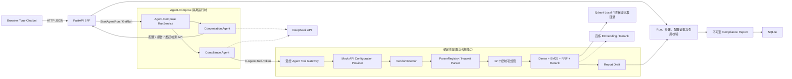
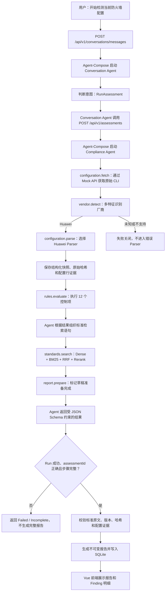

# Bank Firewall Compliance Chatbot

[](https://github.com/TZ3070/firewall-compliance/actions/workflows/ci.yml)

银行防火墙配置合规检测演示系统。用户通过 Vue 单页 Chatbot 查询当前配置、发起检测、筛选 Finding、查看判断依据和历史报告。每条消息先由 Agent-Compose 中的对话 Agent 判断意图；正式检测再由独立的合规 Agent 按受控工具顺序执行。

系统通过配置 Provider 主动获取防火墙原始配置，本期使用保留真实 API 边界的 Mock Provider。当前只支持 Huawei VRP-style Mock CLI，不连接真实设备，不自动修改防火墙配置。输出是基于配置快照和标准条款的技术检查结果，不等同于正式等级保护测评结论。

## 功能

- 每次对话均由 `conversation-orchestrator` Agent 判断意图，并读取配置、检测任务或报告资源。
- 通过 `firewall-compliance-agent` Agent 执行完整合规检测。
- 通过 Mock 配置 API 主动获取原始 CLI，并保存原始采集记录及 SHA-256。
- 使用确定性多特征识别厂商；只有识别为 Huawei 后才选择 Huawei Parser，未知厂商失败关闭。
- 使用 `ParserRegistry` 隔离厂商 Parser，本期注册 Huawei VRP-style CLI Parser。
- 不以等保级别作为扫描入口；12 个控制项统一执行，适用等级只作为 Finding 元数据。
- Agent 必须依次调用配置获取、厂商识别、配置解析、规则判断、标准检索和报告准备工具。
- 四态 Finding：`Passed`、`Failed`、`NeedsReview`、`NotApplicable`。
- 支持在对话中只查看合规、不合规、待复核或不适用条目。
- 展示 Finding 的配置字段、原始配置行号和摘录、标准条款、判断说明及限制。
- 混合 RAG：百炼 Embedding/本地 BGE + BM25 + RRF + 按控制项去重 + 百炼 Rerank。
- 标准引用门禁：只允许已人工审核、可引用且哈希匹配的原文进入最终报告。
- 原始采集、配置快照、Assessment Session 和不可变报告保存到 SQLite；最终报告绑定 Agent Run 和 SHA-256。
- Agent 只能准备报告草稿；Agent Run 成功且工具步骤完整后，后端才校验并固化不可变报告。
- Agent-Compose 或模型不可用时显式返回失败，不会回退到确定性程序并声称 Agent 已执行。

## 技术栈

| 层级 | 技术 |
|---|---|
| 前端 | Vue 3、TypeScript、Vite、Pinia、Vue Router、Element Plus |
| API/BFF | FastAPI、Pydantic v2、Uvicorn |
| Agent 运行时 | [chaitin/agent-compose](https://github.com/chaitin/agent-compose)、双 Agent、ConnectRPC v2 RunService |
| 大模型 | DeepSeek OpenAI-compatible API，由 Agent-Compose LLM facade 提供给 Agent runner |
| 检索 | Qdrant Local、百炼 Embedding、BM25、RRF、百炼 Rerank |
| Parser | 确定性 VendorDetector、ParserRegistry、Huawei CLI Parser |
| 规则 | Python 确定性规则引擎 |
| 存储 | SQLite 原始采集/快照/Run 状态/不可变报告、本地 Qdrant 索引 |
| 质量 | Pytest、Vitest、vue-tsc、GitHub Actions |

## 系统架构


```mermaid
flowchart LR
    U["Browser / Vue Chatbot"] -->|"HTTP JSON"| API["FastAPI BFF"]
    API -->|"StartAgentRun / GetRun"| AC["Agent-Compose RunService"]

    subgraph RUNTIME["Agent-Compose 隔离运行时"]
        AC --> CA["Conversation Agent"]
        AC --> DA["Compliance Agent"]
    end

    CA -->|"配置 / 报告 / 发起检测 API"| API
    DA -->|"X-Agent-Tool-Token"| TOOLS["受控 Agent Tool Gateway"]

    subgraph PIPELINE["确定性配置与合规能力"]
        TOOLS --> FETCH["Mock API Configuration Provider"]
        FETCH --> VENDOR["VendorDetector"]
        VENDOR --> PARSER["ParserRegistry / Huawei Parser"]
        PARSER --> RULES["12 个控制项规则"]
        RULES --> RAG["Dense + BM25 + RRF + Rerank"]
        RAG --> DRAFT["Report Draft"]
    end

    RAG --> QD["Qdrant Local / 已审核标准目录"]
    API --> GATE["Run、步骤、配置证据与引用校验"]
    DRAFT --> GATE
    GATE --> REPORT["不可变 Compliance Report"]
    REPORT --> DB["SQLite"]
    CA -.-> DS["DeepSeek API"]
    DA -.-> DS
    RAG -.-> BL["百炼 Embedding / Rerank"]
```

### 配置检测主链路


```mermaid
flowchart TD
    A["用户：开始检测当前防火墙配置"] --> B["POST /api/v1/conversations/messages"]
    B --> C["Agent-Compose 启动 Conversation Agent"]
    C --> D["判断意图：RunAssessment"]
    D --> E["Conversation Agent 调用 POST /api/v1/assessments"]
    E --> F["Agent-Compose 启动 Compliance Agent"]
    F --> G["configuration.fetch：通过 Mock API 获取原始 CLI"]
    G --> H["vendor.detect：多特征识别厂商"]
    H -->|"Huawei"| I["configuration.parse：选择 Huawei Parser"]
    H -->|"未知或不支持"| H1["失败关闭，不进入错误 Parser"]
    I --> J["保存结构化快照、原始哈希和配置行证据"]
    J --> K["rules.evaluate：执行 12 个控制项"]
    K --> L["Agent 根据结果组织标准检索语句"]
    L --> M["standards.search：Dense + BM25 + RRF + Rerank"]
    M --> N["report.prepare：标记草稿准备完成"]
    N --> O["Agent 返回受 JSON Schema 约束的结果"]
    O --> P{"Run 成功、assessmentId 正确且步骤完整？"}
    P -->|"否"| Q["返回 Failed / Incomplete，不生成完整报告"]
    P -->|"是"| R["校验标准原文、版本、哈希和配置证据"]
    R --> S["生成不可变报告并写入 SQLite"]
    S --> T["Vue 前端展示报告和 Finding 明细"]
```

两个 Agent 的职责不同：

- `conversation-orchestrator`：处理用户消息，判断是发起检测、查询任务、读取当前配置、读取最新报告还是列出历史报告，并调用对应 API。
- `firewall-compliance-agent`：执行正式配置检测，必须按顺序调用 `configuration.fetch`、`vendor.detect`、`configuration.parse`、`rules.evaluate`、`standards.search`、`report.prepare`。

Agent 负责意图、流程编排和检索语句；配置解析、规则计算、引用验证、报告哈希及持久化由确定性后端负责。Agent 不能执行 SQL、直接修改防火墙或绕过工具顺序，也不能直接写入最终报告。

## 模块划分

| 路径 | 职责 | 测试入口 |
|---|---|---|
| `agent-compose.yml` | 双 Agent、Prompt、沙箱环境变量和 DeepSeek Provider 定义 | 在线 Agent-Compose 联调 |
| `frontend/src` | Vue 对话 UI、报告筛选、配置与历史报告展示 | `frontend/src/*.test.ts` |
| `backend/app/api` | Health、Conversation、Assessment、Config、Report 和工具网关 HTTP 边界 | `test_health.py`、`test_agent_tool_workflow.py` |
| `backend/app/models` | 配置、Agent Run、Finding、不可变报告和 RAG 契约 | 各 API/服务合同测试 |
| `backend/app/parsers` | VendorDetector、ParserRegistry 和 Huawei CLI 确定性解析 | `test_huawei_cli_parser.py`、`test_v2_configuration_pipeline.py` |
| `backend/app/providers` | Agent-Compose、Mock 配置、Embedding、Rerank 和 Qdrant 适配 | `test_agent_compose_runtime.py`、`test_qwen_retrieval.py` |
| `backend/app/rules` | 12 个配置控制项规则 | `test_p0_assessment.py` |
| `backend/app/services` | 配置管道、Agent 工具状态机、Assessment、引用校验和报告固化 | `test_agent_tool_workflow.py`、`test_citations_and_reports.py` |
| `backend/app/repositories` | SQLite 原始采集、配置快照、Assessment Session 和报告存储 | `test_snapshot_repository.py`、`test_v2_configuration_pipeline.py` |
| `backend/data/catalog` | 标准目录、审核原文、跨标准映射和 PDF 清单 | 目录、发布与引用测试 |
| `backend/scripts` | 原文发布、索引构建、检索冒烟和 20 组回归评测 | 命令行直接运行 |

## 快速开始

### 1. 环境要求

- Python 3.12
- Node.js 22
- pnpm 10
- Docker
- Agent-Compose CLI 和 daemon
- 完整在线链路需要 DeepSeek API、阿里云百炼 Embedding API 和 Rerank API

### 2. 安装依赖

```bash
git clone git@github.com:TZ3070/firewall-compliance.git
cd firewall-compliance
cp .env.example .env

python3.12 -m venv backend/.venv
backend/.venv/bin/pip install -r backend/requirements.txt -r backend/requirements-dev.txt

cd frontend
pnpm install --frozen-lockfile
cd ..
```

### 3. 配置环境变量

所有应用配置位于项目根目录 `.env`。`.env`、SQLite、Qdrant 索引、模型缓存和前端构建产物均已被 Git 忽略。真实 API Key 和工具令牌不得提交到仓库。

完整在线链路的关键配置：

```dotenv
DEEPSEEK_BASE_URL=https://api.deepseek.com
DEEPSEEK_API_KEY=
DEEPSEEK_MODEL=deepseek-v4-pro

BAILIAN_EMBEDDING_BASE_URL=
BAILIAN_EMBEDDING_API_KEY=
BAILIAN_EMBEDDING_MODEL=text-embedding-v4
BAILIAN_EMBEDDING_DIMENSION=1024

BAILIAN_RERANK_BASE_URL=
BAILIAN_RERANK_API_KEY=
BAILIAN_RERANK_MODEL=qwen3-rerank

AGENT_COMPOSE_ENABLED=true
AGENT_COMPOSE_BASE_URL=http://127.0.0.1:7410
AGENT_COMPOSE_AUTH_TOKEN=
AGENT_COMPOSE_PROJECT_ID=
AGENT_COMPOSE_CONVERSATION_AGENT=conversation-orchestrator
AGENT_COMPOSE_COMPLIANCE_AGENT=firewall-compliance-agent

AGENT_TOOL_TOKEN=replace-with-a-long-random-value
```

`DEEPSEEK_MODEL` 必须填写账号实际可调用的模型 ID。百炼 Embedding 和 Rerank 的 Base URL 可能使用不同兼容路径，应以对应模型的 API 示例为准；Base URL 不要包含末级 `/embeddings` 或 `/reranks`，程序会自行拼接。

`AGENT_TOOL_TOKEN` 由 FastAPI 和 Agent-Compose 沙箱共享，应使用高强度随机值。`AGENT_COMPOSE_PROJECT_ID` 在首次执行 `agent-compose up` 后填写。

主要环境变量：

| 变量 | 默认值 | 用途 |
|---|---|---|
| `DATABASE_PATH` | `./data/app-v2.db` | SQLite 采集、快照、Session 和报告库，相对于 `backend` |
| `QDRANT_PATH` | `./data/qdrant` | 本地 Qdrant 存储目录 |
| `QDRANT_COLLECTION` | `firewall-standard-knowledge-v1` | 知识集合名 |
| `RAG_PREFETCH_LIMIT` | `20` | RRF/Rerank 前的候选池基数 |
| `RAG_ENFORCE_REVIEW_STATUS` | `true` | 只允许 `HumanReviewed` 原文通过引用门禁 |
| `RAG_DENSE_MODEL` | `BAAI/bge-small-zh-v1.5` | 未配置百炼 Embedding 时的本地向量模型 |
| `RAG_SPARSE_MODEL` | `Qdrant/bm25` | BM25 Sparse 模型 |
| `RAG_MODEL_CACHE_PATH` | `./data/model-cache` | 本地模型缓存 |
| `AGENT_COMPOSE_BASE_URL` | `http://127.0.0.1:7410` | Agent-Compose v2 RunService 地址 |
| `AGENT_COMPOSE_PROJECT_ID` | 空 | `agent-compose up` 部署得到的项目 ID |
| `AGENT_COMPOSE_TIMEOUT_SECONDS` | `15` | 单次控制面请求超时，不是整个 Agent Run 时限 |
| `*_TIMEOUT_SECONDS` | 见 `.env.example` | 外部模型请求超时 |

失败和降级行为：

- Agent-Compose 未启动、项目 ID 缺失或 DeepSeek 导致 Agent Run 失败：正式对话/检测显式失败，不伪造 Agent 结果。
- 未配置百炼 Embedding：使用本地 BGE；首次运行可能需要下载模型。
- Embedding 请求暂时失败：重试后回退到 BM25 关键词检索。
- Rerank 未配置或请求失败：保留 RRF 排序，并在运行结果中返回降级提示。
- 要验证当前完整链路，应同时配置并启用 DeepSeek、百炼 Embedding 和百炼 Rerank。

### 4. 构建知识索引

首次启动前构建 Qdrant 索引：

```bash
cd backend
.venv/bin/python -m scripts.index_knowledge
cd ..
```

当前审核目录包含 440 条记录，发布为 688 个逐条款/逐测评单元原文块。预期输出包含：

```text
indexed 688 records
catalog_sha256=...
citation_eligible=688
```

更换 Embedding 模型、向量维度、目录版本或 Qdrant Collection 后必须重建索引。启用或更换 Rerank 不改变向量维度，通常不需要重建索引。

### 5. 运行开发环境

先配置并启动 Agent-Compose。终端 1：

```bash
agent-compose config --quiet
HTTP_LISTEN=127.0.0.1:7410 agent-compose daemon
```

终端 2，在项目根目录部署双 Agent：

```bash
agent-compose up --json
```

将输出的项目 ID 写入 `.env` 的 `AGENT_COMPOSE_PROJECT_ID`。`agent-compose.yml` 会从未提交的 `.env` 注入 DeepSeek Key 和工具令牌；修改 Agent 定义或相关环境变量后重新执行 `agent-compose up`。

终端 3，启动 FastAPI：

```bash
cd backend
.venv/bin/uvicorn app.main:app --reload --host 127.0.0.1 --port 8000
```

终端 4，启动 Vue 前端：

```bash
cd frontend
pnpm dev
```

访问：

- Chatbot：<http://127.0.0.1:5173/>
- Health：<http://127.0.0.1:8000/health>
- Swagger UI：<http://127.0.0.1:8000/docs>
- OpenAPI JSON：<http://127.0.0.1:8000/openapi.json>

健康检查：

```bash
curl http://127.0.0.1:8000/health
```

推荐演示对话：

1. `当前防火墙是什么配置？`
2. `开始检测当前防火墙配置`
3. `哪些不合规？`
4. `只看合规项`
5. `列出历史报告`
6. 在左侧选择一份历史报告查看完整 Finding 和证据。

更完整的运行边界和故障语义见 [Agent-Compose 接入边界](docs/agent-compose-integration.md)。

## 部署

### 本机或内网演示部署

先确保 Docker、Agent-Compose daemon 和 `agent-compose up` 部署的双 Agent 持续可用，再启动后端：

```bash
cd backend
.venv/bin/uvicorn app.main:app --host 127.0.0.1 --port 8000 --workers 1
```

前端构建：

```bash
cd frontend
pnpm install --frozen-lockfile
pnpm build
```

构建结果位于 `frontend/dist`。前端 API 使用 `/health` 和 `/api/...` 同源相对路径，建议用 Nginx/Caddy 托管静态文件，并将两个路径反向代理到 FastAPI。

Nginx 示例：

```nginx
server {
    listen 8080;
    server_name _;
    root /absolute/path/to/firewall-compliance/frontend/dist;
    index index.html;

    location / {
        try_files $uri /index.html;
    }

    location /api/ {
        proxy_pass http://127.0.0.1:8000;
        proxy_set_header Host $host;
        proxy_set_header X-Forwarded-For $proxy_add_x_forwarded_for;
        proxy_set_header X-Forwarded-Proto $scheme;
    }

    location = /health {
        proxy_pass http://127.0.0.1:8000/health;
    }
}
```

部署注意事项：

- 浏览器只访问 FastAPI，不应直接访问 Agent-Compose daemon 或 Agent 工具网关。
- Agent 沙箱必须能够通过 `FIREWALL_API_BASE_URL` 和 `AGENT_TOOL_BASE_URL` 访问 FastAPI。默认 `host.docker.internal` 适用于 Docker Desktop；其他 Docker 环境需要配置等价的宿主机地址。
- Qdrant 使用本地文件模式，演示部署使用单个 FastAPI Worker，避免多个进程同时打开同一本地索引。
- 运行用户必须对 `backend/data` 有写权限；SQLite、Qdrant 和模型缓存都位于该目录。
- API Key 和 `AGENT_TOOL_TOKEN` 通过部署环境或只读 `.env` 注入，不得写入镜像、代码、日志或 Git。
- 当前没有登录、RBAC、TLS 终止和限流，不应直接暴露到公网。
- 仓库没有提供 FastAPI/Vue 的 Dockerfile 或 Kubernetes 清单；`agent-compose.yml` 只定义 Agent，不负责部署应用本身。

## API

| 方法 | 路径 | 说明 |
|---|---|---|
| `GET` | `/health` | 存活检查 |
| `POST` | `/api/v1/conversations/messages` | 启动 Conversation Agent 处理一条用户消息 |
| `GET` | `/api/v1/conversation-runs/{run_id}` | 查询 Conversation Agent Run 和结构化响应 |
| `POST` | `/api/v1/assessments` | 直接启动 Compliance Agent；不接收等保级别 |
| `GET` | `/api/v1/runs/{run_id}` | 查询检测进度，并在 Run 成功后校验、固化报告 |
| `GET` | `/api/v1/compliance-reports` | 查询全部不可变报告 |
| `GET` | `/api/v1/compliance-reports/latest` | 读取最新报告 |
| `GET` | `/api/v1/compliance-reports/{report_id}` | 按 ID 读取报告详情 |
| `GET` | `/api/v1/config/current` | 重新获取、识别并解析一次当前 Mock 配置 |
| `POST` | `/api/v1/agent-tools/configuration/fetch` | Compliance Agent 获取配置摘要 |
| `POST` | `/api/v1/agent-tools/vendor/detect` | Compliance Agent 识别厂商 |
| `POST` | `/api/v1/agent-tools/configuration/parse` | Compliance Agent 选择 Parser 并生成快照 |
| `POST` | `/api/v1/agent-tools/rules/evaluate` | Compliance Agent 执行控制项规则 |
| `POST` | `/api/v1/agent-tools/standards/search` | Compliance Agent 检索标准条款 |
| `POST` | `/api/v1/agent-tools/report/prepare` | Compliance Agent 完成报告草稿步骤 |

`/api/v1/agent-tools/*` 仅供 Agent-Compose 沙箱使用，必须携带 `X-Agent-Tool-Token`，不应暴露给浏览器或第三方客户端。服务端状态机会拒绝越序调用。

对话请求示例：

```bash
curl -X POST http://127.0.0.1:8000/api/v1/conversations/messages \
  -H 'Content-Type: application/json' \
  -d '{"message":"开始检测当前防火墙配置"}'
```

接口返回 `202 Accepted`、`conversation_id`、`run_id` 和 `status_url`。客户端轮询：

```bash
curl http://127.0.0.1:8000/api/v1/conversation-runs/<run_id>
```

当 Conversation Agent 返回 `resourceType=assessment-run` 时，继续轮询 `/api/v1/runs/{run_id}`；检测成功后使用返回的 `report_id` 读取报告。

连续对话时，客户端应把首次响应的 `conversation_id` 传回：

```json
{
  "message": "哪些不合规？",
  "conversation_id": "conversation-..."
}
```

直接启动检测的请求只包含系统和配置源，不包含等保级别：

```bash
curl -X POST http://127.0.0.1:8000/api/v1/assessments \
  -H 'Content-Type: application/json' \
  -d '{"system_id":"bank-core-001","configuration_source_id":"mock-huawei-001"}'
```

## 数据与存储位置

| 路径 | 内容 | 是否提交 Git |
|---|---|---|
| `backend/data/mock/default-firewall.cfg` | 默认 Huawei Mock 原始 CLI | 是 |
| `backend/data/catalog` | 标准目录、审核原文、映射和清单 | 是 |
| `backend/data/huawei-atomic-configs` | 20 组 Huawei Parser、规则与 RAG 回归 CFG 及预期结果 | 是 |
| `backend/data/qdrant` | 运行时生成的当前 Qdrant 索引 | 否 |
| `backend/data/model-cache` | 本地 Dense/Sparse 模型缓存 | 否 |
| `backend/data/app-v2.db` | 运行时采集、快照、Session 和报告 | 否 |
| `outputs` | 本地生成的回归评测结果 | 否 |
| `frontend/dist` | Vue 生产构建产物 | 否 |
| `.env` | 本地 API Key、Agent-Compose 项目 ID 和工具令牌 | 否 |

## 测试

### 自动化测试

后端：

```bash
cd backend
.venv/bin/pytest -q
```

前端：

```bash
cd frontend
pnpm test
pnpm typecheck
pnpm build
```

`.github/workflows/ci.yml` 会在 Push 和 Pull Request 时执行后端测试、前端测试、类型检查和生产构建。

当前工作区验证结果：后端 97 项测试通过，前端 2 项测试通过，Vue/TypeScript 类型检查和 Vite 生产构建通过。

自动化测试不会启动真实 Agent-Compose daemon，也不会调用收费 API。`test_agent_compose_runtime.py` 使用 MockTransport 验证 ConnectRPC 请求、状态映射、结构化输出和错误语义；`test_agent_tool_workflow.py` 验证工具顺序、鉴权和报告固化边界。

### 20 组配置管道与 RAG 回归评测

仓库包含 20 组 Huawei 原子 CFG，用于验证当前配置采集边界、厂商识别、Parser、确定性规则和混合 RAG：

- CFG：[`backend/data/huawei-atomic-configs`](backend/data/huawei-atomic-configs)
- 每份 CFG 的目标标准和预期结果：同名 `.json`

该脚本不伪造 Agent-Compose Run，结果只作为配置管道、规则和 RAG 的离线回归指标，不能代替真实 Agent-Compose 端到端验证。

运行前必须完成 Qdrant 索引构建，并确保索引使用的 Embedding 模型与当前配置一致。配置百炼 Embedding 或 Rerank 时，评测会调用对应真实 API，可能产生费用；未配置 Rerank 时保留 RRF 排序。评测结果写入已被 Git 忽略的 `outputs/huawei-pipeline-evaluation`：

```bash
cd backend
.venv/bin/python -m scripts.evaluate_huawei_agent_scenarios
```

快速冒烟：

```bash
.venv/bin/python -m scripts.evaluate_huawei_agent_scenarios \
  --limit 1
```

脚本输出 Parser 预期匹配数、目标条款 `Recall@8`、当前规则覆盖数、规则结果一致数和检索降级次数。当前版本已经完成 1 组在线冒烟：Parser 匹配、目标条款 `Recall@8=100%`，且未发生检索降级。

真实 Agent-Compose 验收应同时运行 Agent-Compose daemon、双 Agent、FastAPI 和 Vue，再通过 `/api/v1/conversations/messages` 发起检测，确认两个 Run 均成功、六个工具步骤完整、报告的 `agent_runtime` 为 `agent-compose`，且 `agent_run_id` 与真实 Run 一致。

## 标准知识库

当前项目内置并人工审核发布以下四类标准材料：

- GB/T 22239—2019 相关控制要求
- GB/T 20281—2020 相关防火墙要求
- JR/T 0071.2—2020 相关网络安全控制要求
- JR/T 0072—2020 相关测评单元

原文发布流程：

```bash
cd backend

.venv/bin/python -m scripts.extract_verbatim_candidates \
  --docx-root "/absolute/path/to/标准文档/核心标准"

.venv/bin/python -m scripts.publish_reviewed_verbatim
.venv/bin/python -m scripts.index_knowledge
```

机器候选不会自动成为可引用原文。发布脚本会校验审核决定、原文、重复 ID 和哈希；存在 Pending、未说明原因的 Rejected 或哈希不一致时失败关闭。

检索冒烟：

```bash
cd backend
.venv/bin/python -m scripts.search_knowledge "防火墙远程日志和审计留存要求" --limit 5
```

检索顺序为 Dense 与 BM25 双路召回、RRF 融合、按控制项去重和 Rerank。Rerank 已配置时，返回结果来源中应包含 `rerank`；不可用时会保留 RRF 顺序并附带降级提示。

## 安全与审计边界

- 浏览器只访问 FastAPI；Agent-Compose daemon 不直接暴露给浏览器。
- Agent 工具网关要求 `X-Agent-Tool-Token`，并使用常量时间比较校验令牌。
- 原始配置采集、解析快照、Parser 版本、配置 SHA-256、原始行号和摘录保存在 SQLite 中。
- Compliance Agent 的配置工具只返回执行所需摘要，不把整份 CLI 放入该 Agent 的模型上下文。
- 当前配置查询 API 会把内置 Mock CLI 返回给 Conversation Agent 和浏览器；因此真实配置接入前仍必须增加脱敏和访问控制。
- Agent 只能调用白名单 HTTP 工具；服务端状态机拒绝越序调用。
- Agent 不能直接写最终报告。后端检查 Run 成功、`assessmentId`、结构化输出和 `report.prepare` 状态后才固化。
- 标准原文必须满足 `text_kind=verbatim`、`citation_eligible=true`、`review_status=HumanReviewed` 和内容哈希一致。
- 规则结论绑定结构化配置字段；缺少原始配置证据时不能伪造成 `ConfigurationVerified`。
- 报告绑定原始配置、Snapshot、Parser、Rule Pack、标准来源、Agent Run 和报告 SHA-256。
- API Key、Agent-Compose 项目 ID、数据库、索引和模型缓存均不提交 Git。
- 用户消息上限为 4000 字符；Agent 的最终输出受 JSON Schema 约束。

## 当前限制

- 配置 Provider 当前是 Mock API，只读取仓库内置 Huawei 配置，不采集真实设备。
- 只有 Huawei VRP-style Parser；未实现 H3C、Cisco、山石、深信服等厂商 Parser。
- 未实现真实配置脱敏。接入客户 API 前，必须在日志、SQLite、Agent 和公网模型之前处理账号、IP/网段、客户标识、Community、口令、密钥、Token、证书和系统名称。
- 当前 Finding 由 12 个确定性控制项生成；Agent 负责流程和检索编排，不能自由覆盖规则结论。
- 12 个控制项和 688 个知识块不代表标准的全部要求都能仅凭防火墙配置自动证明。
- `conversation_id` 当前用于请求关联，未实现持久化完整多轮消息记忆。
- 每次正式检测至少包含一次 Conversation Agent 和一次 Compliance Agent Run，并涉及 Docker 沙箱、模型请求、RAG 和轮询，因此延迟高于普通确定性 API。
- 不支持登录、RBAC、多用户隔离、多租户、限流或公网安全部署。
- 不支持用户选择等保级别；适用等级只保留为 Finding 元数据。
- 报告没有 PDF 导出、整改工单、自动下发或防火墙配置修改能力。

## 常见问题

### 对话提示“请求未完成：agent execution failed”

依次确认 Agent-Compose daemon 正在监听 `AGENT_COMPOSE_BASE_URL`、`.env` 中的 `AGENT_COMPOSE_PROJECT_ID` 与本次 `agent-compose up` 输出一致、DeepSeek 模型 ID 可调用、Agent 沙箱能访问 FastAPI，以及 `AGENT_TOOL_TOKEN` 在两端一致。修改 `.env` 或 `agent-compose.yml` 后重新执行 `agent-compose up` 并重启 FastAPI。

### 为什么一次检测运行较慢

正式检测先运行 Conversation Agent，再运行 Compliance Agent；后者还要依次启动沙箱、调用六类工具、执行混合检索和 Rerank。前端以 1 秒间隔轮询 Run，完整流程比直接调用确定性规则更慢。保持 daemon 和镜像预热、使用低延迟模型端点、确保百炼/DeepSeek 网络稳定可以减少等待。

### Rerank 为什么没有生效

确认 `.env` 同时设置了 `BAILIAN_RERANK_BASE_URL`、`BAILIAN_RERANK_API_KEY` 和 `BAILIAN_RERANK_MODEL`。任一项为空都会禁用 Rerank；请求失败时系统会保留 RRF 排序并返回降级提示。Rerank 配置变化通常不要求重建 Qdrant 索引。

### 修改 Embedding 后查询失败

检查 `backend/data/qdrant` 的索引 Manifest 是否与当前 Embedding 模型、向量维度、标准目录哈希和 Collection 一致。修改 Embedding 模型或维度后重新运行 `.venv/bin/python -m scripts.index_knowledge`。

### 历史报告没有出现

只有 Compliance Agent Run 成功、六个工具步骤完整且后端完成引用校验后，报告才写入 `backend/data/app-v2.db`。该文件不提交 Git；删除数据库或更换 `DATABASE_PATH` 后，历史报告不会自动恢复。

### 厂商识别失败

VendorDetector 不只信任 Provider 的 `vendor_hint`，还会检查 CLI 特征。配置缺少足够 Huawei 特征，或特征互相冲突时会失败关闭；应补充正确的厂商 Detector/Parser，而不是强制送入 Huawei Parser。

## 相关文档

- [Agent-Compose 接入边界](docs/agent-compose-integration.md)
- [系统骨架和模块边界](docs/system-skeleton.md)
- [统一防火墙标准目录](docs/unified-firewall-catalog.md)
- [跨标准映射报告](docs/firewall-cross-standard-mapping-report.md)
- [标准原文提取审核摘要](docs/verbatim-extraction-summary-v1.md)

## License

仓库当前未附带开源 License。标准原文和整理数据可能受版权或使用限制约束，在公开分发、商用或部署前应单独确认授权范围。
